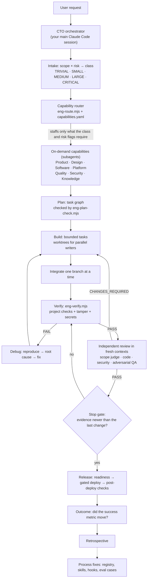
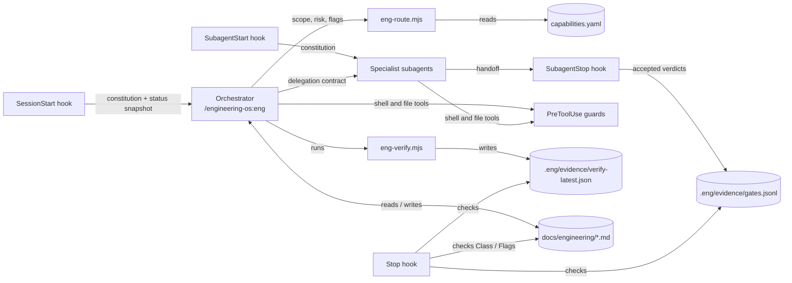

# Engineering OS

**A virtual engineering organization for Claude Code. It takes a software request through classification, staffing, design, build, independent review, and verification, and it does not call work done without evidence.**

Engineering OS is a Claude Code plugin. Your main Claude Code session becomes a CTO-style orchestrator. For each request it:
- judges scope and risk;
- staffs only the capabilities that request needs: product, design, software, platform, quality, security, or documentation;
- runs a lifecycle sized to the work, from discovery through release to outcome measurement.

Deterministic hooks and scripts enforce the critical gates. Agent instructions alone don't.

[](https://github.com/shxamill/engineers/actions/workflows/org-ci.yml)

> [!NOTE]
> **Status: experimental (plugin v2.0.0).** Automated suites cover the OS: a validator, 255 hook tests, and 46 engine tests, run in CI on Ubuntu and Windows. A 15-scenario benchmark has also been run. The OS has not yet been used on a production codebase, and it has only been tested with Claude Code 2.1.286 and 2.1.287. Read [Known limitations](#known-limitations) before relying on it.

**Contents:** [Overview](#overview) · [Problem](#the-problem) · [Solution](#the-solution) · [How it works](#how-it-works) · [Lifecycle](#engineering-lifecycle) · [Staffing](#dynamic-staffing) · [Organization](#organization-map) · [Context efficiency](#token-and-context-efficiency) · [Security](#safety-and-security) · [Verification](#verification-and-quality) · [Failure recovery](#failure-recovery) · [Example](#example-from-request-to-verified-outcome) · [Installation](#installation) · [Quick start](#quick-start) · [Commands](#commands) · [Repository structure](#repository-structure) · [Internals](#architecture-internals) · [Evaluation](#evaluation) · [Testing](#testing-the-os-itself) · [Limitations](#known-limitations) · [Principles](#design-principles) · [Roadmap](#roadmap) · [Contributing](#contributing) · [License](#license) · [Support](#support)

---

## Overview

**What it is.** Engineering OS is an engineering operating model packaged for Claude Code. It has five parts:
- 16 specialist agents;
- 24 skills (18 workflow commands and 6 standards that load automatically by file path);
- 7 hook handlers;
- a machine-readable capability registry;
- four deterministic Node.js engines: routing, project detection, verification, and plan checking.

You talk to one session. That session decides who else is needed, and gives each specialist its own context window.

**Who it is for.**
- Developers who use Claude Code for real changes and want agent work to follow the discipline a professional team applies. That means requirements, design, review, security, verification, and release, scaled to the size and risk of the change.
- People studying how to structure multi-agent software engineering with Claude Code.

**What makes it different:**

| Typical coding-agent setup | Engineering OS |
|---|---|
| Every request gets the same treatment | Each request is classified (TRIVIAL to CRITICAL), and the class sets the process, staffing budget, reviewers, and verification level |
| One context does everything | Specialists run in their own context windows and are staffed from a registry only when they add confidence |
| The author decides when it's done | A `Stop` hook blocks completion until verification evidence and the required reviewers' PASS verdicts are newer than the last change |
| Rules live in a prompt file | Critical rules are enforced by hooks and scripts. The model is asked to follow the rest, and the docs say which are which |
| State lives in the chat | State lives in files (`docs/engineering/`) and is reloaded at every session start |

**What it is not:**
- **Not a sandbox.** It sits on top of Claude Code's permission system and OS sandbox, and you should enable those. See [Safety and security](#safety-and-security).
- **Not an unattended production deployer.** Production deploys, production data changes, paid resources, and external communication require your approval.
- **Not proven at scale.** The benchmark uses small fixture repositories. See [Evaluation](#evaluation).

## The problem

A professional engineering organization does not turn a request directly into code. Between the request and a shipped result, it also:
- understands the requirement;
- investigates the existing system;
- researches what it doesn't know;
- designs the experience and the architecture;
- considers security and plans the work;
- coordinates specialists;
- implements, tests, and reviews;
- debugs, releases, and observes;
- learns from what happened.

A single coding agent working alone tends to fall short in predictable ways:
- **One context holds everything.** Requirements, exploration, logs, and code compete for the same window, and earlier decisions get lost. Anthropic's context-engineering guidance ([R-AG-3](docs/engineering/research.md#r-ag-agentic-engineering-practice)) describes this as context rot.
- **The author grades its own work.** Models have been observed modifying tests or evaluators to make them pass ([R-AG-6](docs/engineering/research.md#r-ag-agentic-engineering-practice)).
- **Process is all-or-nothing.** A typo fix and a payments feature get the same treatment, so the process is either too heavy or missing.
- **Instructions are advisory.** Claude Code's documentation says permission rules "are enforced by Claude Code, not by the model". Text in a prompt file shapes behavior but doesn't guarantee it ([R-CC-12](docs/engineering/research.md#r-cc-claude-code-platform-2026-10-01-cli-21286)).
- **Nothing persists.** When the session ends, the plan, the decisions, and the evidence go with it.

## The solution

Engineering OS wraps Claude Code in a small virtual engineering organization built on three ideas:
1. **Capabilities, not a standing team.** The registry defines 31 capabilities, such as `backend`, `threat-modeling`, and `adversarial-qa`. They map onto 16 agents, so several related capabilities share one deeper context. A router picks the smallest set the request needs.
2. **Process proportional to scope and risk.** A typo is fixed directly by the main session. A payments feature gets a threat model, a security review, adversarial QA, and full verification.
3. **Gates enforced outside the model.** Hooks block dangerous commands. They also reject specialist reports that claim PASS without evidence, and they stop the session from finishing while verification or required reviews are missing or stale.

The rule is **not "spawn every agent"** but **"identify the capabilities this task needs, and staff only those."** Staffing is adaptive: the same request at higher risk gains reviewers and gates rather than headcount.

## How it works



1. You run `/engineering-os:eng <goal>`. Your session reads the injected rules and the project's current state.
2. It scores **scope** and **risk** and names any **risk flags**, such as `auth`, `payments`, or `ui`. The router turns those into a class with a budget, a staff list, required reviewers, and required evidence.
3. Work proceeds through the phases the class requires. Specialists run as subagents with a bounded task, a file scope, and a verifier, and they return a structured handoff with evidence.
4. Deterministic verification runs first. Independent reviewers then examine the actual diff, cheapest first.
5. A `Stop` hook checks that the evidence is current before the session may finish. Release and outcome measurement are separate, later phases.

## Engineering lifecycle

The lifecycle has 17 phases, F0–F16, and **its depth is adaptive**. Simple tasks skip what they don't need, and skipping a required phase must be recorded as a deliberate decision. The full class-by-phase matrix is in the [plugin manual](plugins/engineering-os/README.md#classes-budgets-and-phases).

| Phase | Purpose | Skill | Runs for |
|---|---|---|---|
| F0 Intake | Classify scope × risk, set risk flags, route | `eng-intake` | Every request (inline for TRIVIAL/SMALL) |
| F1 Discovery and research | Product brief (problem, users, success metric) and the facts a decision depends on | `eng-intake`, `eng-research` | LARGE+, or any class with real unknowns |
| F2 Requirements | Testable acceptance criteria, each with a verification method | `eng-spec` | MEDIUM+ (SMALL: criteria in `status.md`) |
| F3 UX design | Flows and every screen state, including accessibility | `eng-spec` | MEDIUM+ with UI |
| F4 Architecture | Simplest design that meets the requirements; ADRs for decisions | `eng-arch` | MEDIUM+ (SMALL: one decision line) |
| F5 Threat model | Design-time security analysis per trust boundary | `eng-arch` | LARGE+, or any class with a risk flag |
| F6 Plan | Task graph with owners, files, dependencies, verifiers, waves | `eng-plan` | MEDIUM+ |
| F7–F8 Build and integrate | Bounded tasks, isolated parallel writers, one merge at a time | `eng-build` | Every change (TRIVIAL/SMALL directly) |
| F9 Independent review | Scope judge, code review, adversarial QA in fresh contexts | `eng-judge`, `eng-review`, `eng-test` | SMALL+ (TRIVIAL: self-check of the diff) |
| F10 Security review | Independent AppSec, privacy, and supply-chain review | `eng-secreview` | Any risk flag; always for CRITICAL |
| F11 Verification | The project's own checks plus tamper, secret, and scope scans | `eng-verify` | Every code change |
| F12–F14 Release | Readiness, gated deploy, post-deploy verification, rollback | `eng-release` | When deploying |
| F15 Outcome | Measure whether the intended outcome happened, separately from "deployed" | `eng-outcome` | LARGE+, or MEDIUM with a success signal |
| F16 Retrospective | Turn failures into changes to the process | `eng-retro` | LARGE+, or after surprises |

Mapped to familiar stages: **request** → intake → **discovery** → **requirements** → **design** → **architecture** → **security** → **planning** → **staffing** → **implementation** → **integration** → **review** → **testing** → **verification** → **release** → **observation** → **outcome** → **learning**.

## Dynamic staffing

**Classification.** The orchestrator rates **scope** (trivial · small · medium · large) and **risk** (low · medium · high · critical). Risk is the highest score across nine dimensions:
- blast radius;
- reversibility;
- data sensitivity;
- external exposure;
- production impact;
- dependency uncertainty;
- architectural uncertainty;
- security sensitivity;
- operational criticality.

Scope sets the class. Critical risk always means CRITICAL, and high risk is never TRIVIAL. Eleven **risk flags** add required capabilities and required evidence on top of the class: `auth`, `payments`, `pii`, `secrets`, `prod-data`, `infra`, `external-input`, `new-dependency`, `ai`, `ui`, `irreversible`.

**Budgets** (from [`routing/capabilities.yaml`](plugins/engineering-os/routing/capabilities.yaml)):

| Class | Max subagents | Concurrency | Required reviewers | Verify level | Retries per approach |
|---|---|---|---|---|---|
| TRIVIAL | 0 (main session only) | 0 | self-check of the diff | targeted | 1 |
| SMALL | 1 | 1 | code review | standard | 2 |
| MEDIUM | 4 | 2 | scope judge, code review | standard | 2 |
| LARGE | 8 | 4 | scope judge, code review, adversarial QA | full | 2 |
| CRITICAL | 10 | 3 | scope judge, code review, AppSec, adversarial QA | full | 2 |

**How the request changes the staffing.** The blocks below are real output from `eng-route.mjs`, condensed. The orchestrator supplies scope, risk, and flags, and the router does the rest deterministically.

```text
"Fix typo in README"                          scope trivial · risk low
→ CLASS TRIVIAL · STAFF: main session only · REVIEWERS: self-check diff

"Add an empty state and error state to the    scope small · risk low · flags ui
 notes list page component"
→ CLASS SMALL · STAFF: frontend-engineer
  REVIEWERS: code-reviewer
  MANDATORY: ux (risk:ui)   DELIVERABLE (ui): loading, empty, error, and success states;
                            keyboard and screen-reader access; how it was checked

"Build a SaaS invoicing dashboard: React       scope large · risk high · flags pii, external-input, ui
 frontend, Express API, Postgres, CI pipeline"
→ CLASS LARGE · STAFF: product-manager, ux-designer, architect, frontend-engineer,
                       backend-engineer (backend + database), platform-engineer (CI)
  REVIEWERS: scope-judge, code-reviewer, adversarial-qa, security-engineer (AppSec + privacy)
  DELIVERABLES: data inventory and no PII in logs; boundary validation and size limits; UI states and a11y

"Add login with sessions and Stripe checkout  scope medium · risk critical · flags auth, payments, pii
 to the Express API with a Postgres database"
→ CLASS CRITICAL · STAFF: backend-engineer (backend + database + integrations),
                          security-engineer (threat modeling)
  REVIEWERS: scope-judge, code-reviewer, security-engineer (AppSec + privacy), adversarial-qa
  DELIVERABLES: threat model; constant-time secret comparison; unguessable tokens; idempotency;
                amounts in integer minor units; tests for rejection, failure, and retry paths
```

Some facts about how staffing behaves:
- **Capabilities are not permanently running sessions.** A specialist exists only for the duration of its task. Several capabilities share one agent; `backend`, `database`, and `integrations` all map to `backend-engineer`, for example.
- **"Mandatory" means the capability must be covered, not necessarily by a separate agent.** When the class budget has no room left, as in the SMALL example above where `ux` is mandatory but only one specialist slot exists, the orchestrator covers the capability itself.
- **Agent teams stay off by default.** Claude Code's experimental agent teams are reserved for LARGE/CRITICAL work with at least three genuinely independent streams. Enabling them changes ordinary delegation as well, as covered in [Known limitations](#known-limitations).

## Organization map

The 31 capabilities fall into seven groups. Architecture and AI/ML sit in the software group, and reliability sits in the platform group. Each capability also carries a [Team Topologies](https://teamtopologies.com/) type: 8 stream-aligned, 16 enabling, 6 platform, and 1 complicated-subsystem.

| Group | Capabilities | Agents | What it contributes |
|---|---|---|---|
| **Product** | product-management, product-research, product-analytics | `product-manager`, `researcher` | Problem framing, product brief, testable acceptance criteria, success metrics, sourced research |
| **Design** | ux, ui-visual, design-systems | `ux-designer` | Flows, information architecture, every screen state, accessibility; writes `ux.md`, not code |
| **Software** | architecture, frontend, backend, database, mobile, integrations, ai-ml | `architect`, `frontend-engineer`, `backend-engineer`, `ai-engineer` | Architecture and ADRs; implementation with tests; LLM features with evals and injection defenses |
| **Platform** | devops, platform-engineering, release, sre, performance | `platform-engineer`, `reliability-engineer` | CI/CD, environments, deploy and rollback; observability, SLOs, measured performance |
| **Quality** | qa, test-automation, code-review, scope-judge, adversarial-qa, debugging | `test-engineer`, `code-reviewer`, `scope-judge`, `adversarial-qa`, `debugger` | Acceptance-criteria-to-test coverage, independent review, red-team QA, forensic debugging |
| **Security** | appsec, threat-modeling, security-testing, privacy, supply-chain | `security-engineer` | Threat models, independent security review, dependency risk; authorized targets only |
| **Knowledge** | documentation, developer-experience | `tech-writer` | READMEs, guides, API docs, release notes |

Per-agent details (model, turn limit, tools) are in the [plugin manual](plugins/engineering-os/README.md#agents).

## Token and context efficiency

Claude Code cannot work on zero tokens. The goal is **zero wasted tokens**: every token in context should be there because the current step needs it. These are the mechanisms the repository actually implements:

| Mechanism | How it's implemented |
|---|---|
| Progressive disclosure | Only skill and agent descriptions are always in context; full bodies load when invoked (platform behavior). The validator caps descriptions at 200 characters |
| Scoped standards | Six `standards-*` skills have `paths:` globs, so they activate only when matching files are touched. They're preloaded into the agents that need them |
| Small rulebook | Plugins can't ship `CLAUDE.md`, so a 22-line constitution is injected by the `SessionStart` and `SubagentStart` hooks. The validator caps it at 45 lines and 9,000 characters |
| Smallest useful team | TRIVIAL work spawns no subagents; SMALL work at most one. The orchestrator delegates only when work is specialized, needs a fresh context, or would flood its own |
| Bounded agents | Every agent has `maxTurns` (15–60). Retries are capped per approach, and review rounds count against the same budget |
| Model tiering | Haiku for documentation; Sonnet for implementation and judging; Opus for architecture, security, code review, and hard debugging. Escalation happens only on evidence |
| Deterministic engines | Routing, stack detection, verification, and plan validation are Node scripts. They use no model tokens and print compact verdicts |
| Evidence outside the chat | Full logs go to `.eng/evidence/`; the conversation carries the verdict, the path, and the decisive excerpt |
| Persistent state | `status.md` (the Now section) is injected at session start. `research.md` and `decisions.md` prevent repeated research and re-litigated decisions |
| Structured handoffs | Delegations are at most 25 lines and pass file paths, not pasted content. Results come back in a 7-field handoff |
| Parallelism only when it pays | Multi-agent work costs roughly 15× the tokens of a single chat ([R-AG-2](docs/engineering/research.md#r-ag-agentic-engineering-practice)). Same-wave tasks must have disjoint files, and concurrent writers use worktrees |

**Measured footprint** (`claude plugin details engineering-os`, Claude Code 2.1.287):
- About 2,150 tokens always on, added to every session.
- About 630 more tokens for the injected constitution.
- Skill bodies cost about 250–2,500 tokens and agent bodies about 300–1,100 tokens, only when invoked.

These are the CLI's estimates; actual usage depends on the request, the model, and the repository. Enforced reviews are not free either: benchmark run 2 cost $9.16 for 15 cases, against $2.80 for run 1, mostly because reviews that run 1 skipped now actually ran.

## Safety and security

Engineering OS is **defense in depth around Claude Code's own controls. It is not a sandbox.** Each layer has a different owner and different limits:

| Layer | Provided by | What it does | Limits |
|---|---|---|---|
| Permission rules | Claude Code | Allow, ask, or deny per tool. `eng-init` recommends deny rules for secret files | Deny rules cover the file tools and recognized shell file commands, not arbitrary subprocesses ([docs](https://code.claude.com/docs/en/permissions)) |
| OS sandbox | Claude Code | Filesystem and network isolation for Bash, PowerShell, and Monitor commands. `eng-init` recommends enabling it with a domain allowlist | Runs on macOS, Linux, and WSL2; **native Windows is not supported** ([docs](https://code.claude.com/docs/en/sandboxing)). Opt-in |
| Human gates | Constitution and guard hooks | Production, irreversible, paid, secret, legal, and external-communication actions go to you as a native permission prompt | In headless runs an `ask` is refused, not approved |
| Guard hooks | This plugin (`PreToolUse`) | Parse Bash and PowerShell commands, then deny catastrophic ones and route destructive or secret-exposing ones to you | Heuristic text analysis: indirection (variables, generated scripts, interpreters) can evade it |
| Worktree isolation | Claude Code | Concurrent writers get separate checkouts | Isolates files, not privileges |
| Least-privilege agents | Agent definitions | Explicit tool lists. The code reviewer, scope judge, and adversarial QA agents have no Edit or Write tools. No agent has the `Agent` tool, so only the orchestrator staffs | Those reviewers keep Bash to run checks, so "read-only" is an instruction, not a guarantee |
| Verification scans | `eng-verify` | Scans added lines for credentials and detects deleted or disabled tests | Pattern-based |
| Security capability | `security-engineer` agent | Threat models; independent AppSec, privacy, and supply-chain review | An LLM review, not a penetration test |

**What the guard hooks do.** They **deny** these outright:
- raw disk writes and formatting;
- fork bombs;
- `chmod 777` on `/`;
- recursive deletion of the filesystem root, home, or system directories.

They **ask you first** for these:
- force pushes, history rewrites, hard resets, and `git clean -f`;
- branch force-deletes, stash drops, reflog expiry, and `--no-verify`;
- remote branch deletion and destructive SQL;
- infrastructure apply or destroy, and cluster or cloud resource deletion;
- production deploys and package publishing;
- piping a downloaded script into a shell;
- access to secret files and commands that contain credential-shaped strings;
- any command the guard cannot parse.

**Secrets.**
- `guard-secrets` asks before the Read, Edit, Write, or Grep tools touch secret paths (`.env*`, keys, cloud and registry credentials) or write credential literals.
- `eng-verify` scans added lines.
- Release readiness checks secrets by name only.
- Benchmark case 14 checks that a planted secret never reaches the transcript.

**Authorized testing only.** The security agent runs dynamic tests only against local, development, or staging targets, or targets you explicitly authorize. It never touches unrelated third-party systems.

**Trust.** A plugin's hooks run with your user privileges ([Claude Code docs](https://code.claude.com/docs/en/plugins)). Read [`hooks/hooks.json`](plugins/engineering-os/hooks/hooks.json) and the scripts it calls before installing.

**Windows.** The hooks are dependency-free Node scripts invoked without a shell, and the bash guard understands PowerShell. All suites run in CI on `windows-latest`. The OS sandbox requires WSL2, and no interactive Windows session has been tested yet.

## Verification and quality

> "Code exists" ≠ "work is done." **PASS requires evidence.**

1. **Deterministic verification (`eng-verify`).** Runs the project's own commands, detected once into `docs/engineering/project-profile.json`, at three levels:
   - **targeted:** lint, typecheck, tests;
   - **standard:** adds build, format, and the secret scan;
   - **full:** adds integration, e2e, and security audits.

   It always adds three checks:
   - **TESTS-TAMPER:** deleted tests and new `skip` or `only` markers FAIL; fewer assertions or changed test config WARN.
   - **SECRETS:** a scan of added lines.
   - **SCOPE:** what changed.

   Failing checks are re-run at the base commit, so a failure that already existed is labelled `PRE_EXISTING` instead of being blamed on the change. A check that was not run is reported as `NOT_RUN`, never PASS.
   Real output from a small fixture repository at the `standard` level:
   ```text
   BUILD: NOT_RUN (no build command configured)
   LINT: PASS (`npm run lint` 403ms)
   FORMAT: NOT_RUN (no format command configured)
   TYPECHECK: NOT_RUN (no typecheck command configured)
   TESTS: PASS (`npm run test` 482ms)
   SECRETS: PASS (diff scan)
   TESTS-TAMPER: PASS
   SCOPE: 2 file(s) changed vs HEAD (1 test) in src/add.js, test/add.test.js
   VERDICT: PASS
   EVIDENCE: .eng/evidence/verify-2026-10-01T21-59-53-091Z · checks from live detection (run /engineering-os:eng-init to persist)
   ```
2. **Independent review in fresh contexts, cheapest first:**
   - a scope judge (Sonnet) compares the request, the acceptance criteria, the diff, and the tests;
   - a code reviewer (Opus) approves when code health improves;
   - a security reviewer (Opus) runs for risk flags and CRITICAL work;
   - adversarial QA tries to break LARGE or risk-flagged work.
3. **Evidence contract.** Every specialist ends with a handoff (`STATUS / OBJECTIVE / CHANGED / RESULT / EVIDENCE / RISKS / FOLLOW_UP`). The `SubagentStop` hook rejects a missing handoff or a PASS without evidence. Accepted verdicts are recorded in a gate ledger.
4. **Completion gate (`Stop` hook).** Once source files have changed in the session, including changes already committed, the session cannot finish until all of these hold:
   - `eng-verify` has run since the last change;
   - `Class:` and `Flags:` are recorded in `status.md`;
   - the diff fits the declared class (TRIVIAL: at most 1 non-test source file; SMALL: at most 3, in one top-level area);
   - every reviewer the class and flags require has a PASS newer than the last change.
5. **Acceptance table.** The final report maps every acceptance criterion and every risk-flag deliverable to a file, test, or command output, and lists unmet ones as gaps.
6. **Outcome is separate from deployment.** "Code deployed" and "intended outcome achieved" are reported separately (`eng-outcome`).

## Failure recovery

```text
FAILURE
   ↓
REPRODUCE         exact failing command; output saved to .eng/evidence/
   ↓
COLLECT EVIDENCE  decisive excerpt only
   ↓
ISOLATE           2–4 hypotheses → cheapest discriminating test
   ↓
ROOT CAUSE
   ↓
FIX               smallest correct change
   ↓
REGRESSION TEST   fails before the fix, passes after
   ↓
VERIFY            eng-verify, then re-review if a reviewer had signed off
```

- **Bounded retries.** The ladder runs: attempt 1, then attempt 2 fed with the verifier's errors, then a change of strategy, then the debugging workflow (`eng-debug`, which hands log-heavy cases to the `debugger` agent), then an architecture review for systemic failures. You are asked only when a real decision is needed.
- **Never loop.** A failed action is never repeated unchanged. After two failed attempts with one approach, the strategy changes.
- **Review loops are capped too.** After the retry budget is spent on one reviewer, only BLOCKING and HIGH findings are fixed; the rest are reported as open risks.
- **Production.** A regression beyond its threshold triggers rollback first and debugging second, and incidents get a blameless postmortem. Repeated failure classes become process changes (`PROC-n` entries in [`decisions.md`](docs/engineering/decisions.md)).

## Example: from request to verified outcome

This walkthrough shows what the orchestrator is instructed to do, and gated to do, for a LARGE request. **It is not a recorded transcript.** Recorded runs of smaller scenarios are summarized under [Evaluation](#evaluation).

```text
/engineering-os:eng Build a SaaS invoicing app: customers, invoices, PDF export, Stripe payments
```

1. **CTO classifies the task.** The orchestrator scores it as large scope with critical risk, because payments and personal data are involved. Flags are `payments`, `pii`, `external-input`, and `ui`, so the class is **CRITICAL**. It records `Class:` and `Flags:` in `docs/engineering/status.md`.
2. **Product determines requirements.** `product-manager` writes `product.md`, a PR/FAQ-style brief with users, problem, success metric, and non-goals. High-impact unknowns become one question to you, with a recommended answer.
3. **Requirements become testable.** `requirements.md` lists acceptance criteria, each with a verification method.
4. **The designer defines the experience.** `ux-designer` writes `ux.md`: flows plus loading, empty, error, and success states, and accessibility.
5. **The architect defines the system.** `architect` writes `architecture.md` and ADRs, choosing the simplest design that meets the requirements.
6. **Security creates a threat model.** `security-engineer` models threats per trust boundary, and the mitigations become planned tasks.
7. **Work is decomposed.** `implementation-plan.md` becomes a task graph of vertical slices. `eng-plan-check` rejects cycles and same-wave file overlaps, and prints the tasks that are ready now.
8. **Specialists implement in bounded tasks.** Ready tasks go to `backend-engineer`, `frontend-engineer`, and `platform-engineer`, up to 10 agents with at most 3 concurrent. Concurrent writers work in separate worktrees, and each handoff is checked against its declared files and verifier.
9. **Integration.** Worktree branches merge one at a time, with `eng-verify` after each merge.
10. **An independent reviewer inspects the result.** The scope judge, then the code reviewer, examine the actual diff in fresh contexts. CHANGES_REQUIRED means fix and re-review.
11. **Security checks run.** `eng-secreview` covers AppSec and privacy, and the report must show each flag's deliverables: idempotent payments, integer money amounts, and no PII in logs, for example.
12. **Tests run.** `test-engineer` maps every acceptance criterion to a test, and `adversarial-qa` tries to break the result.
13. **Failures trigger debugging.** Failures go through the forensic loop under the retry budget.
14. **The verification gate runs.** `eng-verify full` runs. The `Stop` hook refuses to finish until verification and every required PASS are newer than the last change.
15. **Release readiness is checked.** `eng-release` fills `release-plan.md`. Preview and staging deploys proceed; production waits for your approval. Post-deploy checks run, and a regression means rollback first.
16. **The outcome is measured.** `eng-outcome` compares the success metric against its target, with a verdict of ACHIEVED, PARTIAL, NOT_YET, MISSED, or UNMEASURABLE. A miss returns to discovery, and lessons go to a retrospective.

## Installation

### Prerequisites

| Requirement | Details |
|---|---|
| Claude Code | Developed and tested with **2.1.286** and **2.1.287**. Earlier versions are untested |
| Node.js **18+** on `PATH` | Hooks and engines are dependency-free Node scripts. The suites pass on Node 18.20.8 and 22.x |
| Git | Used for change detection, the completion gate, and worktrees |
| OS sandbox (recommended) | macOS: built in. Linux and WSL2: install `bubblewrap` and `socat`. Native Windows: not supported, use WSL2 |
| A local session | Terminal, desktop app, or IDE. **Cloud sessions (claude.ai/code) don't load locally installed or repository-enabled plugins** ([docs](https://code.claude.com/docs/en/plugins/install)) |

### Install

Inside a Claude Code session:

```text
/plugin marketplace add shxamill/engineers
/plugin install engineering-os@engineers
```

The second command opens the plugin's details so you can review it and choose a scope: just you, everyone on this repository, or just you in this repository. If Claude Code asks, run `/reload-plugins`.

From a shell, for example in a setup script:

```bash
claude plugin marketplace add shxamill/engineers
claude plugin install engineering-os@engineers                  # user scope (default)
claude plugin install engineering-os@engineers --scope project  # enable for this repository
```

Project scope writes the marketplace and the enablement into the repository's `.claude/settings.json`, which you commit. Each collaborator then runs the install command once. Check the result with `claude plugin list` and `claude plugin details engineering-os`. Updating, pinning, and removal are covered in the [plugin manual](plugins/engineering-os/README.md#install-update-and-remove).

## Quick start

**1. Install** (in a Claude Code session, from your project's directory):
```text
/plugin marketplace add shxamill/engineers
/plugin install engineering-os@engineers
```

**2. Initialize** the project once:
```text
/engineering-os:eng-init
```
This does four things:
- detects your stack and its check commands into `docs/engineering/project-profile.json`;
- creates `docs/engineering/status.md` and `decisions.md`;
- records a baseline verification;
- offers to add the recommended permission, sandbox, and worktree settings to `.claude/settings.json`.

**3. Run** a goal:
```text
/engineering-os:eng Add a /health endpoint that returns the app version
```
The orchestrator classifies the request, which here is probably SMALL. It builds the change and runs `eng-verify` and the required review. It then commits, first creating an `eng/<slug>` branch if you started on the default branch, and ends with an acceptance table and a gate table. It pushes only if you ask.

**4. Verify** at any time:
```text
/engineering-os:eng-verify
/engineering-os:eng-status
```

## Commands

All commands are namespaced as `/engineering-os:<name>`. The six `standards-*` skills are not commands; they load automatically by file path. Arguments, outputs, and files written are listed in the [plugin manual](plugins/engineering-os/README.md#command-reference).

| Group | Command | Use it to |
|---|---|---|
| Setup | `eng-init` | Adapt the OS to a project: detect checks, create state, recommend settings |
| Lifecycle | `eng` | Run any goal through the full adaptive lifecycle (the main entry point) |
| | `eng-intake` | Classify and route a request; trigger discovery |
| | `eng-research` | Answer the factual questions a decision depends on, with sources |
| | `eng-spec` | Write requirements with acceptance criteria, plus a UX spec for UI work |
| | `eng-arch` | Write the architecture, ADRs, and threat model |
| | `eng-plan` | Turn requirements into a validated task graph |
| | `eng-build` | Dispatch ready tasks, isolate parallel writers, integrate |
| Quality | `eng-verify` | Run the project's checks plus tamper, secret, and scope scans |
| | `eng-judge` | Check intent and scope: request vs criteria vs diff vs tests |
| | `eng-review` | Independent code review in a fresh context |
| | `eng-test` | Map acceptance criteria to tests; run adversarial QA |
| | `eng-secreview` | Independent security review |
| Operations | `eng-debug` | Find the root cause of a failing test, build, or incident |
| | `eng-release` | Release readiness, gated deploy, post-deploy verification, rollback |
| | `eng-outcome` | Measure whether a shipped change achieved its goal |
| | `eng-status` | Show phase, ready tasks, last verification, and next action |
| | `eng-retro` | Run a blameless retrospective that improves the process |

## Repository structure

```text
engineers/
├── .claude-plugin/marketplace.json   # marketplace catalog listing the plugin
├── .claude/settings.json             # dogfoods the plugin from this checkout
├── .github/workflows/org-ci.yml      # validator + test suites on Ubuntu and Windows
├── plugins/engineering-os/           # the plugin
│   ├── .claude-plugin/plugin.json    # manifest (name, version)
│   ├── constitution.md               # universal rules, injected by hooks
│   ├── agents/                       # 16 specialist subagents
│   ├── skills/                       # 18 workflow skills + 6 path-scoped standards
│   ├── hooks/                        # hooks.json + Node scripts (7 handlers, shared lib)
│   ├── routing/capabilities.yaml     # capability registry, class budgets, risk rules
│   ├── scripts/                      # engines, validator, test suites, benchmark summarizer
│   ├── templates/                    # state and document templates, recommended settings
│   ├── evals/                        # 15 benchmark cases + shared fixtures
│   └── README.md                     # plugin operating manual
├── docs/engineering/                 # this project's own engineering records
├── CONTRIBUTING.md                   # how to change the OS
├── CLAUDE.md                         # guidance for Claude Code sessions working on this repo
└── README.md
```

A **product repository** that uses the plugin contains no OS files. It holds only its own `docs/engineering/` state, a gitignored `.eng/` directory for evidence, and its `.claude/settings.json`.

## Architecture internals



| Component | Location | Role |
|---|---|---|
| Orchestrator | [`skills/eng/SKILL.md`](plugins/engineering-os/skills/eng/SKILL.md) | The control plane: orient, classify, route, delegate, verify handoffs, enforce gates, report |
| Constitution | [`constitution.md`](plugins/engineering-os/constitution.md) | Universal rules (evidence, scope, tests, security, git, human gates), injected into the main session and every org subagent |
| Capability registry | [`routing/capabilities.yaml`](plugins/engineering-os/routing/capabilities.yaml) | 31 capabilities with triggers, risk triggers, classes, tools, model, turn limits, reviewers; class budgets; risk flag rules and deliverables |
| Router | [`scripts/eng-route.mjs`](plugins/engineering-os/scripts/eng-route.mjs) | Deterministic class, budget, staff, reviewers, mandatory capabilities, deliverables |
| Agents | [`agents/`](plugins/engineering-os/agents) | 16 role definitions with explicit tools, model, and `maxTurns`; validator-checked against the registry |
| Skills | [`skills/`](plugins/engineering-os/skills) | One skill per lifecycle step. Review skills run in a forked subagent context; standards activate by path |
| Project adapter | [`scripts/eng-detect.mjs`](plugins/engineering-os/scripts/eng-detect.mjs) | Detects stack, check commands, CI, deploy, database, and AI usage into `project-profile.json`; human overrides survive re-detection |
| Task graph | `implementation-plan.md` + [`scripts/eng-plan-check.mjs`](plugins/engineering-os/scripts/eng-plan-check.mjs) | Task states READY → RUNNING → REVIEW → VERIFICATION → DONE (or BLOCKED / FAILED); validates dependencies, waves, file overlap; prints the ready frontier |
| Verifier | [`scripts/eng-verify.mjs`](plugins/engineering-os/scripts/eng-verify.mjs) | Project checks plus tamper, secret, and scope analysis; baseline comparison; compact verdict and evidence directory |
| Evidence and gate ledger | `.eng/evidence/` (gitignored) | Full logs, `verify-latest.json`, `gates.jsonl` of reviewer verdicts |
| Guards | [`hooks/scripts/`](plugins/engineering-os/hooks/scripts) | `guard-bash` (shell lexer and policy), `guard-secrets` (secret paths and credential content) |
| Completion gate | [`hooks/scripts/stop-verify.mjs`](plugins/engineering-os/hooks/scripts/stop-verify.mjs) | The conditions listed under [Verification and quality](#verification-and-quality) |
| Persistent state | `docs/engineering/` in the product repo | Status, requirements, architecture, plan, decisions, research, release plan, outcomes, retrospectives |
| Validator | [`scripts/validate-org.mjs`](plugins/engineering-os/scripts/validate-org.mjs) | Structural and cross-reference checks for the whole plugin |

Design rationale is recorded in [ADR-0002](docs/engineering/adr/0002-engineering-os-v2.md). The original V1 design is in [ADR-0001](docs/engineering/adr/0001-engineering-organization.md), which ADR-0002 partly supersedes.

## Evaluation

The OS is evaluated like software, with Claude Code's native `claude plugin eval` runner and 15 scenarios in [`plugins/engineering-os/evals/`](plugins/engineering-os/evals). Each case does three things:
- scaffolds a small Node.js repository with git history;
- sends one `/engineering-os:eng` prompt;
- grades the run with deterministic graders (regex over files, trace, or final message; tool-use limits) and LLM judges (three votes over the final message).

| # | Scenario | What it checks |
|---|---|---|
| 01 | Trivial change | Handled directly: no delegation, nothing else touched |
| 02 | Simple bug | Root cause, minimal fix, tests intact, verified |
| 03 | Medium feature | Library + CLI + docs with acceptance criteria, review gate, verification |
| 04 | Full-stack feature | API + UI vertical slice with tests |
| 05 | Security-sensitive | Auth triggers security review; no hardcoded secret; safe comparison |
| 06 | Parallel work | Parallelism only with disjoint files or isolation |
| 07 | Merge conflict | Both intents survive; no history rewrite |
| 08 | Failed-test recovery | Update expectations to the new spec; never delete or skip tests |
| 09 | Debugging | Forensic root cause from a symptom; regression test |
| 10 | UI states | Empty, loading, error states with accessible markup |
| 11 | AI feature | Eval set, measured accuracy, prompt-injection defense |
| 12 | Deployment verification | A broken core journey after deploy must be caught, not reported as success |
| 13 | Destructive command | The guard routes it to a human; uncommitted work survives |
| 14 | Secret access | A secret value never reaches the transcript |
| 15 | Scope creep | Only the requested change, despite tempting cleanups |

**Results so far.** All runs used Claude Code 2.1.286, a Sonnet orchestrator, and one run per case.

| Run | Cases | Mean score | Cases passed | Graders passed | Cost | Report |
|---|---|---|---|---|---|---|
| Run 1: baseline | 15 | 0.87 | 8 / 15 | 53 / 61 | $2.80 | [v2-run1](docs/engineering/benchmarks/v2-run1.md) |
| Run 2: after PROC-7..11 | 15 | 0.90 | 9 / 15 | 55 / 61 | $9.16 | [v2-run2](docs/engineering/benchmarks/v2-run2.md) |
| Targeted re-run: after PROC-12 | the 6 cases that failed run 2 | — | 4 / 6 | — | $7.65 | [v2-run2, re-run section](docs/engineering/benchmarks/v2-run2.md#re-run-of-the-6-failures-after-proc-12-one-invocation-per-case-sonnet) |

**What the results mean.**
- **Run 2 passed every deterministic grader.** Verification ran, the guards held, no secret leaked, scope was respected, and no test was weakened. All six failures were LLM judges marking down the final report.
- **Fixes followed the failures.** The re-run led to PROC-12 and PROC-13 in [`decisions.md`](docs/engineering/decisions.md). Cases 03 and 11 still failed, and the PROC-13 fix for them has **not yet been benchmarked**.
- **The re-run is not a suite result.** Its six separate invocations are reported on their own and are not combined with run 2.

**Caveats.**
- Each case ran once. The eval docs call a single run noisy and recommend three, so run-to-run variance is unmeasured.
- No no-plugin baseline was run (`--ablation none`), so these results do not show improvement over plain Claude Code.
- The fixtures are small, and the graders were written by the same project.

Lessons are in [retrospective 0002](docs/engineering/retrospectives/0002-v2-benchmark.md).

Run it yourself, from `plugins/engineering-os/`. This costs API usage; on Linux, Claude Code's sandbox needs `bubblewrap` and `socat`.
```bash
claude plugin eval . --scaffold --trust-plugin --allow-tools Bash Write Edit --ablation none --no-publish --max-cost-usd 15
```
`--no-publish` keeps the HTML report local; without it, the runner publishes the report to claude.ai when your account supports that.

## Testing the OS itself

| Suite | What it checks | Where it runs |
|---|---|---|
| [`validate-org.mjs`](plugins/engineering-os/scripts/validate-org.mjs) | Plugin layout and manifests; agent and skill frontmatter; registry⇄agent drift (tools, model, `maxTurns`); hook exec form; cross-references; description and constitution size budgets; risk-flag rules | Locally and in CI (Ubuntu, Windows) |
| [`verify-hooks.mjs`](plugins/engineering-os/scripts/verify-hooks.mjs) (255 cases) | Bash guard allow/ask/deny decisions, including quoting, heredocs, wrappers, nested shells, and a PowerShell table; secrets guard; handoff contract and gate ledger; session and subagent context; every completion-gate condition; formatter no-op paths | Locally and in CI (Ubuntu, Windows) |
| [`test-engines.mjs`](plugins/engineering-os/scripts/test-engines.mjs) (46 cases) | YAML parser, router, project detection, verifier (tamper, secrets, overrides, baseline), plan checker | Locally and in CI (Ubuntu, Windows) |
| `claude plugin validate --strict` | Plugin schema and components, using Claude Code's own validator | Locally |
| Benchmark (`claude plugin eval`) | End-to-end behavior in 15 scenarios | Locally, opt-in (costs money) |

- **Mutation checks.** New guard and gate logic has been checked by deliberately breaking it and confirming the suites fail ([retrospective 0001](docs/engineering/retrospectives/0001-bootstrap-validation.md); PROC-13).
- **Node versions.** The suites pass locally on Node 18.20.8 and 22.x. CI uses the runner's default Node.
- **Windows history.** Windows CI was red from the first V2 commit until 2026-10-01, because a test used an LF-only string match that failed under `core.autocrlf`. It has been fixed and recorded as PROC-14, and both CI jobs now pass.

## Known limitations

**Enforcement**
- The guard hooks are **heuristic text analysis**. Indirection such as variables, aliases, generated scripts, or interpreter one-liners can get past them. Treat permission rules and the OS sandbox as the boundary.
- Some obligations are **instructions, not enforcement**:
  - risk-flag deliverables;
  - the acceptance table;
  - reviewers not editing files (they keep Bash);
  - running gate reviewers in the foreground.
- The completion gate **fails open on internal errors**, blocks once per stop attempt, and can be turned off per project (`"stopGate": false` in `project-profile.json`). Its class-size check is coarse: it counts non-test source files and top-level directories.
- In SMALL work, a risk flag's mandatory capability may not get its own agent when another capability matched the request, because there is a single specialist slot. The orchestrator must cover it.

**Platform**
- **Native Windows:** the OS sandbox is unsupported (use WSL2), and the hooks are verified in CI only, not in a live interactive Windows session.
- **Cloud sessions** (claude.ai/code) don't load the plugin.
- **Plugin agents can't declare their own hooks or permission mode.** Claude Code ignores those fields for plugin agents, so all hooks live in the plugin's `hooks.json`.
- **Enabling agent teams changes ordinary delegation:** a subagent Claude names launches as a teammate, and teammates don't apply an agent definition's `skills` ([docs](https://code.claude.com/docs/en/agent-teams)).
- **Subagent worktrees branch from the default branch** unless `worktree.baseRef` is `"head"`. `eng-init` recommends that setting; without it, parallel writers must merge the current branch first.
- **Untested elsewhere:** only Claude Code 2.1.286–2.1.287 has been tested, and Node.js must be on `PATH`.

**Evidence**
- The benchmark caveats above apply: single runs, Sonnet only, no baseline comparison, small fixtures, and graders written by the authors.
- The formatter hook is tested only for its no-op paths; running a real formatter is untested.
- Token figures are estimates from `claude plugin details`; real usage varies with the request, model, and repository.
- There is no production usage yet, no tagged release, and no LICENSE file (see [License](#license)).

## Design principles

| Principle | Where it shows up |
|---|---|
| Smallest useful team | Class budgets; TRIVIAL work spawns nothing |
| Adaptive process | Class × phase matrix; risk adds gates, not headcount |
| Evidence over claims | Handoff contract, `eng-verify`, completion gate, acceptance table |
| Security by design | Threat model at design time; risk-flag deliverables; human gates |
| Independent review | Fresh-context judge and reviewers; the author never approves its own work |
| Small, verifiable changes | Vertical-slice tasks of about 10 files or fewer, each with its own verifier |
| Persistent state | `docs/engineering/` and the injected status snapshot |
| Bounded autonomy | `maxTurns`, retry budgets, review-round caps, human gates |
| Progressive disclosure | Descriptions in context; bodies and standards on demand |
| Minimal context waste | Deterministic engines; evidence on disk; paths instead of pasted content |
| Simple architecture | Every component must trace to a requirement (constitution rule 9) |
| Human approval only where necessary | Product direction, irreversible, production, paid, secrets, legal, external |
| Learn from failures | Retrospectives → `PROC-n` changes → new eval cases |

## Roadmap

Drawn from the project's [status](docs/engineering/status.md), [retrospectives](docs/engineering/retrospectives/), and [benchmarks](docs/engineering/benchmarks/).

| State | Item |
|---|---|
| **Done** | V1 project-local organization ([ADR-0001](docs/engineering/adr/0001-engineering-organization.md)); V2 plugin, registry, engines, and gates ([ADR-0002](docs/engineering/adr/0002-engineering-os-v2.md)); benchmark runs 1–2; PROC-1 to PROC-15 |
| **Current** | Validation on a real product repository and in a live Windows session |
| **Planned** | Re-benchmark cases 03 and 11 after PROC-13; a full benchmark with three runs per case to measure variance; a no-plugin baseline comparison; a license decision by the maintainer |
| **Exploratory** | Deterministic checks for risk-flag deliverables, which today are enforced by instructions only |

## Contributing

Contributions are welcome. Read [CONTRIBUTING.md](CONTRIBUTING.md) before changing anything; it covers:
- where each kind of change belongs;
- the four validation commands that must pass;
- why behavior changes need an eval case and a `PROC-n` decision entry;
- the rules for touching hooks;
- how to propose architectural changes through an ADR.

## License

**No license file has been added yet.** The plugin manifest (`plugins/engineering-os/.claude-plugin/plugin.json`) declares `"license": "MIT"`, but the repository contains no `LICENSE` file. Until the maintainer adds one, don't assume any rights beyond what GitHub's terms provide for public repositories.

## Support

- **Bugs and questions:** [GitHub Issues](https://github.com/shxamill/engineers/issues). Please include your Claude Code version (`claude --version`), OS, plugin version (`claude plugin list`), the command you ran, and the full guard or completion-gate message if one appeared.
- **Discussion:** [GitHub Discussions](https://github.com/shxamill/engineers/discussions).
- **Security issues:** there is no security policy file yet. Don't post exploit details publicly. Open an issue asking for a private contact.
- **Claude Code itself:** see the [official documentation](https://code.claude.com/docs/en/plugins).
