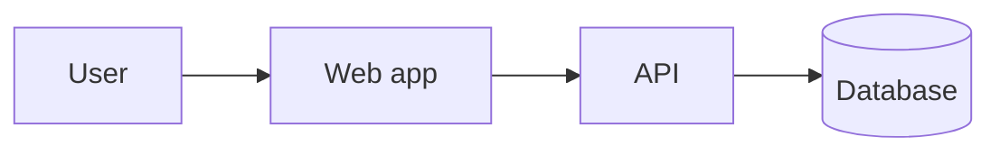

# Architecture — <system>
_Owner: architect · Updated: YYYY-MM-DD · Describes the ACTUAL system; items not yet built are marked PLANNED_

## Context & drivers
<key requirements (FR/NFR ids) and constraints that shape the design>

## System overview

## Components
| Component | Responsibility | Tech | Owner agent |
|---|---|---|---|

## Interfaces & contracts
| Endpoint / interface | Request | Response | Errors | Auth |
|---|---|---|---|---|

## Data model
<entities, key fields, relationships, constraints, indexes; PII marked>

## Security model
<authN, authZ (roles, object-level checks), trust boundaries, secrets handling — details in security.md>

## Failure modes
| Failure | Detection | Handling | User impact |
|---|---|---|---|

## Deployment topology
<environments, hosting, build/release path, config/secrets source>

## Observability
<logs, metrics, traces, health checks, alerts, SLOs>

## Scaling path
<current capacity assumption; what changes at 10× and why it isn't built yet>

## Rollback
<how each release/migration is reversed>

## Decisions
<links to ADRs>
