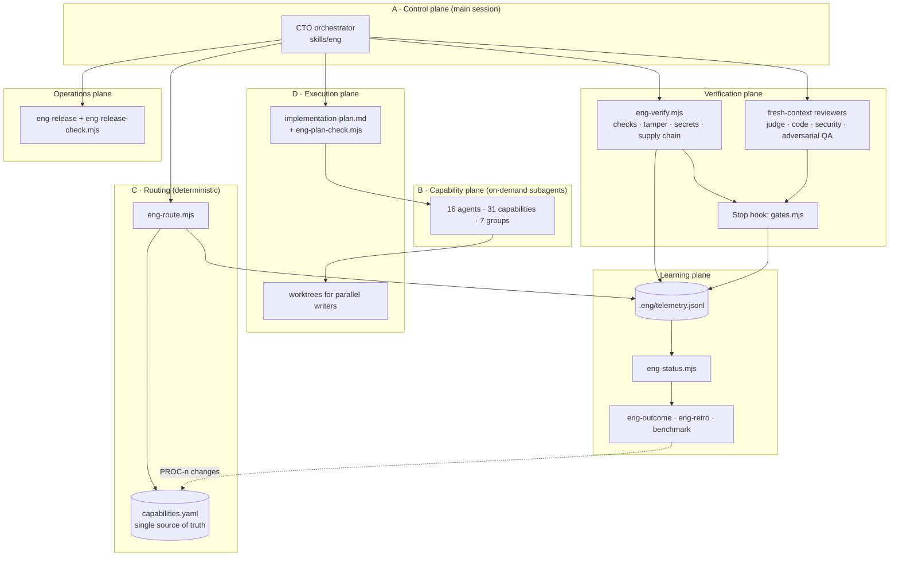
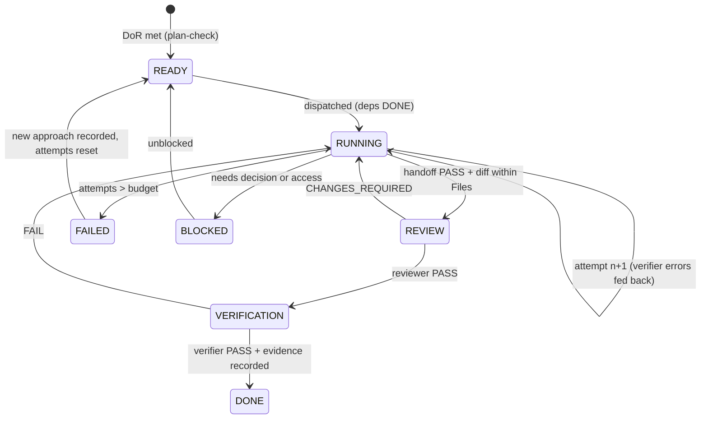
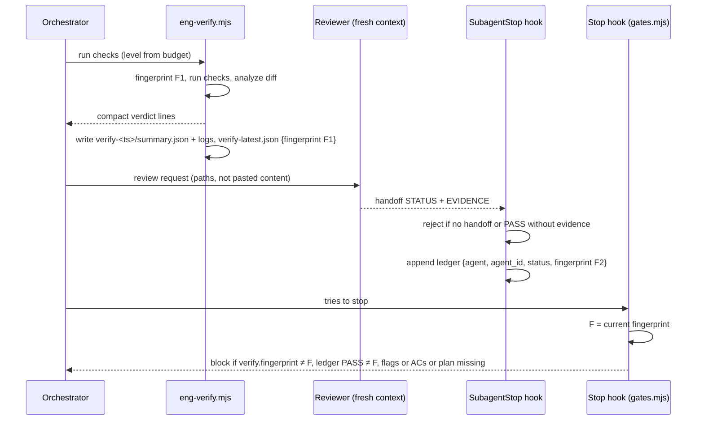
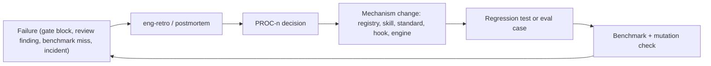

# Engineering OS V3 — architecture

_Status: implemented in plugin 3.0.0 · Decisions: [ADR-0003](adr/0003-engineering-os-v3.md), [ADR-0004](adr/0004-evaluation-model.md) · Evidence: [v3-research](v3-research.md), [v3-audit](v3-audit.md)_

V3 keeps V2's shape: a Claude Code plugin with a main-session orchestrator, on-demand specialist subagents, deterministic engines, and hooks. It changes **what counts as proof**, **how classification is checked**, and **how the system observes itself**. Each change traces to an audit finding (A-xx) and a test.

The design principle comes from research AG-3: add complexity only where it buys measurable reliability, security, or context efficiency. V3 adds no services, queues, databases, or schedulers. Everything is Node scripts with no dependencies, plus files, Git, and Claude Code's native components.

## 1. Layers



| Layer | Owns | Deterministic parts | Model judgment |
|---|---|---|---|
| A · Control plane | Outcome, classification, staffing, coordination, completion | Router, plan checker, gates | Goal understanding, trade-offs, conflict resolution |
| B · Capability plane | Specialist work in fresh contexts | Tool allowlists, `maxTurns`, handoff contract | Design, implementation, review content |
| C · Routing | Class, budget, staff, reviewers, required evidence | `eng-route.mjs` over `capabilities.yaml` | Dimension scores (recorded, and checked against paths) |
| D · Execution | Task graph, isolation, integration | `eng-plan-check.mjs` (DoR/DoD, cycles, scopes, owners, retries) | Decomposition |
| Verification | Proof that work is done | `eng-verify.mjs`, completion gate, gate ledger | Scope judge, code review, security review, adversarial QA |
| Operations | Release readiness, staged rollout, post-deploy checks | `eng-release-check.mjs`, guard prompts for production | Rollout strategy, SLO choice |
| Learning | Outcomes, retrospectives, OS metrics | Telemetry, `eng-status.mjs`, benchmark | Root-cause analysis, process changes |

**The CTO never assumes "worker said PASS, therefore PASS".** Worker verdicts reach the gate only through the ledger, and only when they're bound to the exact content the gate sees (section 5).

## 2. Capability model and routing

`routing/capabilities.yaml` is the **only** authoritative table. Prompts reference it and never restate it.

| Registry section | Content | Consumers |
|---|---|---|
| `tiers` | `low: haiku`, `medium: sonnet`, `high: opus` | Validator (agent `model` must equal `tiers[capability.tier]`), router output |
| `risk_dimensions` | The nine dimensions scored at intake | Router `--dims` |
| `budgets` | Per class: max agents, concurrency, research, retries, verify level, required reviewers, diff ceiling | Router, gate, plan checker |
| `gates` | Per gate: the classes it applies to (`acceptance_criteria`, `plan_complete`) | Gate, status |
| `risk_requirements` | Flag → required capabilities | Router, gate |
| `risk_deliverables` | Flag → evidence the report must show | Router, final report |
| `risk_paths` | Flag → path regex that implies the flag | Gate (flags vs changed files) |
| `capabilities[]` | id, agent, group, topology, purpose, triggers, risk_triggers, classes, inputs, outputs, tools, scopes (file scope), tier, max_turns, parallel, depends, reviewers, security; reviewer capabilities also carry `skill` and `reviewer_gate` | Router, validator, gate |

Budget impact is **derived** from `tier` × `max_turns`, so there's no second field to drift.

**Validator cross-checks:**
- registry ↔ agent: tools, model via tier, `maxTurns`;
- registry ↔ skill: a reviewer capability's `skill` exists and its forked `agent` is the same agent;
- registry ↔ reviewer requirements: budget reviewers and flag reviewers are `reviewer_gate` capabilities;
- every risk flag has requirements, deliverables, and a valid path regex where one is given;
- frontmatter keys are allowlisted.

**Classification (A-04).** `eng-route --scope <s> --dims blast-radius=high,reversibility=low,…`:
- Risk is the maximum of the dimension scores. A `--risk` below that maximum is rejected.
- The class is the scope class; critical risk means CRITICAL; high risk is never TRIVIAL.
- The decision is logged to telemetry with its dimensions.

**Staffing algorithm (A-03).**
1. Collect the capabilities required by risk flags.
2. Collect the capabilities the request triggers, sorted by number of matching triggers.
3. Exclude reviewer-gate capabilities from staffing; they become reviewers.
4. Staff **required first**, then triggered, then truncate to the class budget (TRIVIAL 0, SMALL 1, …).
5. Required capabilities that don't fit stay listed as MANDATORY. The orchestrator covers them itself or reports them unmet.

The output is CLASS, RISK (with its drivers), BUDGET, STAFF, REVIEWERS, MANDATORY, DELIVERABLE lines, and GATES.

**Delivery cells.** Each project gets the smallest cross-functional cell that can own the outcome. Real router output for typical requests is shown in the [README](../../README.md#dynamic-staffing). Agent teams and dynamic workflows (research CC-15, CC-16) are opt-in only:
- **Agent teams:** at least 3 independent streams that need peer communication.
- **Workflows:** homogeneous fan-out, such as a migration across hundreds of files.

Either requires a recorded reason and a budget.

## 3. Lifecycle

The lifecycle runs F0 intake → F1 discovery → F2 requirements → F3 UX → F4 architecture → F5 threat model → F6 plan → F7 build → F8 integrate → F9 independent review → F10 security review → F11 verification → F12 release readiness → F13 deploy → F14 post-deploy verification → F15 outcome → F16 retrospective.

The depth is set by the class. The matrix lives in `skills/eng` and is rendered in the plugin manual.

**Phases that are skippable but checked** (A-08):

| Gate | Applies to | Satisfied by | Recorded skip |
|---|---|---|---|
| `acceptance_criteria` | SMALL+ | An `AC-n` line (not a template placeholder) in `status.md` or `requirements.md` | `Skipped: acceptance_criteria (<reason>)` in status Now |
| `plan_complete` | MEDIUM+ | `implementation-plan.md` passes `eng-plan-check` with no task in READY, RUNNING, REVIEW, or VERIFICATION | `Skipped: plan_complete (<reason>)` |
| Verification | any class, when source changed | `verify-latest.json` fingerprint equals the current tree | — (never skippable) |
| Required reviewers | SMALL+ by class; flag reviewers at any non-TRIVIAL class | Ledger PASS at the current fingerprint | — |
| Class fits diff | TRIVIAL, SMALL | Non-test source files and areas within the ceiling | Reclassify |
| Flags fit paths | any class | Each flag implied by changed paths is declared, or `Waived: <flag> (<reason>)` | Waiver with reason |

### Definition of Ready (task)

These are enforced by `eng-plan-check` for tasks in READY or later states:
- a capability from the registry, or `orchestrator`;
- an owner that is the registry agent for that capability, or `orchestrator`;
- dependencies that exist, belong to earlier waves, and contain no cycles;
- a non-empty file scope that doesn't overlap any same-wave task;
- a verifier command;
- acceptance-criteria references (`AC-n`).

### Definition of Done

**Per task** (`eng-plan-check`):
- every dependency is DONE;
- an Evidence entry exists, and its path exists when it is a path;
- attempts are within the class retry budget, or the task is FAILED or BLOCKED.

**Per objective** (completion gate, plus the final-report contract):
- acceptance criteria met;
- tests appropriate, with no tamper findings;
- security addressed: flag reviewers PASS and deliverables shown;
- reviews complete at the current content;
- verification at the current content;
- the diff fits the class, and the flags fit the paths;
- documentation updated where the report lists it;
- evidence recorded.

## 4. Execution plane



The plan table columns are:

`ID | Objective | Capability | Owner | Depends | Wave | Files | AC | Verifier | Risk | Attempts | Evidence | State`

V2 tables, which lack AC, Attempts, and Evidence, are still accepted, with a migration warning.

**Parallel writers:**
- Each parallel writer gets `isolation: "worktree"`, with `worktree.baseRef: "head"` recommended (PROC-15).
- Each gets a task ID, a file scope, an out-of-scope list, its own branch, and its own commit.
- Branches merge one at a time, with `eng-verify` after each merge.
- Same-wave file overlap is rejected before dispatch.

**Retry ladder** (bounded by the class budget, recorded in Attempts):
1. Attempt 1.
2. Attempt 2, fed with the verifier output.
3. Change strategy: record it in Notes and reset Attempts.
4. `eng-debug` with the debugger agent.
5. Architecture review for a systemic failure.
6. The human, only for a real decision.

## 5. Verification and evidence model

### Content fingerprint (A-01)

`sourceFingerprint(dir)` copies the git index to a temporary file, runs `git add -A` and `git write-tree` against that temporary index, then lists the tree. It keeps only source paths (the same NON_SOURCE filter the gate uses) and hashes the `mode blob path` lines. The result has these properties:

- **Content-addressed.** Committing, stashing and restoring, or checking out the same content leaves it unchanged.
- **Change-sensitive.** Any edit to a tracked or untracked non-ignored source file changes it.
- **Independent of mtimes and clocks**, which matters on Windows and after git operations.
- **Side-effect free.** The real index is never touched, and only blob objects are written.

### Evidence lifecycle



`verify-latest.json` (schema 2) contains the fields below. Logs live under `.eng/evidence/verify-<ts>/`.

```json
{
  "schema": 2, "task": "T-3", "commit": "<HEAD sha>", "fingerprint": "<16 hex>",
  "timestamp": "2026-10-02T12:00:00.000Z", "level": "standard", "verdict": "PASS",
  "checks": [{ "name": "test", "kind": "test", "status": "PASS", "command": "npm run test", "durationMs": 482, "evidence": ".eng/evidence/verify-…/test.log" }],
  "signals": { "tamper": [], "warn": [], "secrets": [], "supplyChain": { "fail": [], "warn": [] }, "newDependencies": [] },
  "lines": ["…compact verdict lines…"], "evidence": ".eng/evidence/verify-…"
}
```

**Check statuses:**
- `PASS`, `FAIL`, `TIMEOUT`;
- `PRE_EXISTING`: fails identically at the base commit;
- `NOT_RUN`: applicable, but no command configured, so this is a gap;
- `NOT_APPLICABLE`: declared in profile `overrides.notApplicable` with a reason.

Nothing is silently omitted.

**Deterministic diff analyses** (always run, because they're cheap):

| Analysis | Result | What it reports |
|---|---|---|
| **TESTS-TAMPER** | FAIL | Deleted tests; added skip or `only` markers; CI bypass (`\|\| true` on a test, lint, or check command; `continue-on-error: true`; `--passWithNoTests`); a test script replaced by a no-op |
| | WARN | Net assertion loss; a lowered coverage threshold; verification config changed |
| **SECRETS** | FAIL | Credential patterns in added lines (plus gitleaks if configured) |
| **SUPPLY-CHAIN** | FAIL | `permissions: write-all`; `pull_request_target` combined with a PR-head checkout |
| | WARN | An action not pinned to a full SHA; a manifest changed without its lockfile |
| | signal | New dependencies (feeds the `new-dependency` flag) |
| **SCOPE** | report | Files, test files, lines added and removed, top-level areas |

**Integrity defenses (A-02).** These defend against accidental staleness and opportunistic forgery:
1. The fingerprint is bound to verification and to reviewer verdicts.
2. `guard-bash` denies shell commands that write to `.eng/evidence`, `.eng/state`, or `.eng/telemetry.jsonl`, or that invoke `check-handoff` or `stop-verify` directly. That includes redirection from `echo` and `printf`.
3. `guard-secrets` denies Edit and Write to those paths.
4. The gate cross-checks that the evidence directory named in `verify-latest.json` exists and that its `summary.json` agrees.

**Residual risk** (research CC-10/11): the agent's shell runs as the same OS user as the hooks. A deliberately adversarial agent could still forge files by indirect means. The independent verifiers are **CI**, which runs outside the session, and **human review** of the evidence. The OS sandbox narrows what the shell can write.

**Reviewers:**
- The scope judge (Sonnet, read-only) compares the request, acceptance criteria, diff, and tests, and returns PASS or CHANGES_REQUIRED.
- The code reviewer (Opus) reviews design, functionality, complexity, tests, maintainability, security, documentation, and regressions. Severities are BLOCKING, SHOULD_FIX, and NIT; only BLOCKING produces CHANGES_REQUIRED.
- The security reviewer runs for flags and for CRITICAL work.
- Adversarial QA runs for LARGE work, or for MEDIUM work with flags.

The order is deterministic checks first, then the cheap judge, then the expensive reviewers.

## 6. Security architecture

**Throughout the lifecycle:**
- requirements, with ASVS IDs for security criteria;
- a threat model following the OWASP four questions: assets, actors, trust boundaries, entry points, data flows, STRIDE, mitigations, residual risk;
- secure design and implementation, through the `standards-security-sensitive` skill;
- automated checks: SECRETS, SUPPLY-CHAIN, and audits at the `full` level;
- independent security review;
- authorized security testing only, against local, development, staging, or explicitly authorized targets;
- release readiness: no open CRITICAL or HIGH findings.

**Boundary (defense in depth; unchanged from ADR-0002 except the evidence-integrity layer):**

| Layer | Mechanism | Enforced by |
|---|---|---|
| OS sandbox | Filesystem and network isolation for shell commands (macOS, Linux, WSL2; **not native Windows**) | Claude Code (opt-in via `eng-init`; state shown at session start) |
| Permissions | Deny rules for secret files; ask and deny modes | Claude Code |
| Tool restrictions | Per-agent allowlists; no `Agent` tool for workers | Agent frontmatter + validator |
| Hooks | Catastrophic deny; destructive, secret, and production ask; evidence-tamper deny | `guard-bash`, `guard-secrets` |
| Application security | Threat model, standards, review, scans | Skills, agents, `eng-verify` |
| CI security | Pinned actions, least-privilege tokens, CI as the independent verifier | Project CI (checked by SUPPLY-CHAIN on diffs) |

**SSDF traceability** (research SEC-1):
- **PO:** constitution and human gates.
- **PS:** guards, sandbox, evidence integrity.
- **PW:** threat model, standards, review, verification.
- **RV:** debugging, postmortems, retrospectives.

**Secrets.**
- Secret files are behind an `ask`, and credential literals are flagged.
- Verification scans added lines.
- `eng-release-check --env` reports names as PRESENT or MISSING and never prints a value.
- Telemetry records guard reasons, never command text.

## 7. Operations plane

- **Environments:** LOCAL → CI → PREVIEW → STAGING → PRODUCTION, using only those the project has.
- **`eng-release-check.mjs`:** validates `release-plan.md` and returns READY or NOT_READY. It checks:
  - every readiness row is PASS, or N/A with a reason, and has evidence;
  - production has a named human approval;
  - at the post-deploy stage, every check has an actual value and none failed.

  Guard hooks ask before production deploys whatever the plan says.
- **SRE:** for meaningful services, define 1–3 SLIs and SLOs (error budgets where useful), health checks, and rollback triggers. Post-deploy checks cover health, smoke tests, the critical journey, error rate, latency, and infrastructure.
- **Three separate outcomes:** **deployment success**, **system health** (post-deploy checks), and **product outcome** (`eng-outcome` against the success metric). DORA-style delivery data is diagnostic only (research ORG-8).

## 8. Learning plane

**Telemetry.** `.eng/telemetry.jsonl` is append-only, local, and gitignored. It records:

| Event | Writer | Fields |
|---|---|---|
| `route` | eng-route | class, risk, dims, flags, staffed, reviewers |
| `spawn` | SubagentStart | agent, agent_id |
| `handoff` | SubagentStop | agent, agent_id, status, accepted |
| `verify` | eng-verify | verdict, failing kinds, tamper/secrets/supply-chain counts |
| `guard` | guards | decision (ask/deny), reason category |
| `gate` | Stop | result (pass/block), missing gate keys |

**`eng-status.mjs`** is a deterministic report: project, class, risk, phase, tasks, active agents (spawned without a handoff), blockers, verification freshness, reviews, security, release, outcome, the last gate result, and cost counters. Counters include routes, spawns per route, verify runs and failures, reviewer rounds, and guard asks and denies. `--metrics` aggregates across the telemetry file.

**Learning loop:**



## 9. Context strategy

| Mechanism | Detail |
|---|---|
| Always-on budget | Descriptions ≤ 200 characters each and ≤ 5,600 characters in total, path-scoped standards included (validator; V3: 5,080); constitution ≤ 45 lines |
| On demand | Skill bodies on invoke; standards by `paths`; engines print compact lines |
| No repeated work | `research.md` before researching; the project profile instead of rescanning; `eng-status.mjs` instead of model gathering |
| Bounded agents | `maxTurns` per agent; a partial result means FAIL or BLOCKED and the agent is resumed, not respawned |
| Delegation economics | Multi-agent work costs about 15× chat (AG-7); the class budget caps it, and telemetry measures it |
| Measurement | `claude plugin details` estimate plus a first-turn delta measured with and without the plugin (E-1) |

## 10. Plugin architecture and distribution

The layout is unchanged from ADR-0002:
- the plugin lives in `plugins/engineering-os/`;
- the marketplace is this repository;
- product repositories hold only `docs/engineering/`, `.eng/` (gitignored), and `.claude/settings.json`.

V3 is version `3.0.0`, with a `CHANGELOG.md` and [`v3-migration.md`](v3-migration.md). Every behavior change bumps the version.

## 11. Human gates

The human decides only these:
- product direction and materially ambiguous behavior;
- irreversible architecture;
- destructive or production data and infrastructure changes;
- secrets and credentials;
- paid commitments;
- legal and compliance interpretation;
- high-risk security actions;
- external communication.

Everything else is an engineering responsibility. That includes tests, logs, lint, debugging, reviews, research, and retries.

Mechanically:
- guards turn the dangerous subset into native `ask` prompts;
- `eng-release-check` requires a named human approval for production;
- uncertainty is reported as CONFIRMED, LIKELY, UNKNOWN, or BLOCKED.
